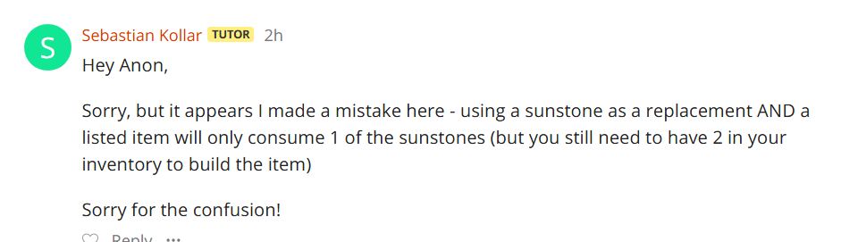

# Assignment II Pair Blog Template

## Task 0) Core Investigation 🔎

> What is the difference in purpose between the `DungeonManiaController` and the `Game` classes? (1 mark)

[Answer]
The `Game` class is stores more of the main functions and logic for managing the state of the game where as `DungeonManiaController` 
has the job of managing the server sided inputs such as the APIs and does not directly handle the games logic and code. 
`Game` is more of the backend manager while `DungeonManiaController` is the frontend manager.

> In the game, player and enemy actions to be performed later are stored as "comparable callbacks". Callbacks are pieces of code that can be run at a later time. However, for what purpose are these callbacks made *comparable*? (1 mark)

[Answer]
All actions are queued in priority of player actions, potion/bribe effects and enemy actions through enums (PLAYER_MOVEMENT, POTION_BRIBE_UPDATE, AI_MOVEMENT) that are passed into the comparable callback constructor as a paremeter (priority) and are stored as 'v'. The purpose of these callbacks being comparable is to facilitate priority within the queue by comparing each instance of callbacks' value of 'v'. This ensures that within a queue of multiple actions in a tick, those that hold the highest priority, or value of 'v' are taken from the queue first and are run. 

> Why is it so important that the dungeon files used for testing follow the technical specification? (4.1.1 in the MVP spec) (1 mark) 

[Answer]
Testing requires using the JSON prefixes and they are all casesensitive and some have similar spelling. If the spec is not followed properly we could accidentally call the wrong thing and get a different output giving us the assumptions ours tests are passing or failing 
when they shouldnt be.

> The Game class includes a method with the signature public Game tick(Direction movementDirection). Provide a detailed explanation of what this method does, including an overview of all the other methods it calls. Additionally, explain the purpose of the callback system it interacts with, and clarify the intentions behind the tickActions, futureTickActions, and currentAction fields. (1 mark)

[Answer]
public Game tick(Direction movementDirection) queues player movement onto the queue for a tick by calling the registerOnce function and passing in the player.move() function that takes a direction and attempts to move the player if the new position leads to a valid position on the map. The registerOnce function uses the callback function to store the runnable method player.move() into either the queue for the current tick, or the next, depending if the current tick is occuring or not. The tick function is then called to start the tick and register all actions in the queue for the current tick. This is done by accessing the priority queue tickActions and extracting the callback with the highest priority in currentAction. The runnable stored inside the callback is then run if valid and then is invalidated if their 'once' value is set to true. The tick then ends and the futureTickActions queue that stored actions made when the tick was in progress is set to tickActions, ready for the next tick. The function tick method then returns itself, the game object to be passed into the ResponseBuilder to create a DungeonResponse.

> A player with 10 health and 1 attack, holding a sword which gives a +1 attack bonus, battles a spider with 4 health and 1 attack. How many rounds of battle occur? How many ticks does the battle take? Explain how you came to this conclusion, referring to lines of code. How do the answers to these questions change if the player has additionally drunk an invisibility potion? (1 mark)

[Answer]
initially the player has 10 health and 2 attack due to the sword and the spider has 4 health and 1 attack. The battle fucntion tells us that once either the player or enemy reaches 0 they are destroyed. In in the battlefacade class we can see that the players is passed first so it attacks first but this doesnt matter since both of the entities healths are calculated so both can die. This fight would take 2 ticks leaving the player on 8 health. first tick would make the player be 9HP and spider 2HP and then the 2nd tick killing the spider. 
But if the player had an invisibility potion it would be used at the start of the fight and has a attack magnefier of 1 and damage reducer of 1 essentially cancelling out the spiders attack causing it to still die in 2 ticks but leaving the player on 10hp still.

## Task 1) Code Analysis and Refactoring ⛏️

### a) From DRY to Design Patterns

[Links to your merge requests](https://nw-syd-gitlab.cseunsw.tech/COMP2511/25T1/groups/W17A_BEAGLE/assignment-ii/-/merge_requests/4)

> i. Look inside src/main/java/dungeonmania/entities/enemies. Where can you notice an instance of repeated code? Note down the particular offending lines/methods/fields.

in Mercenary.java line 110 in the move method case "invincible" is identical to Zombietoast.java runaway case in its move method on line 39. Since this large nblock if code 
is the exacvt same it could easily be refactores and moved to be chared in both classes.

NotifyPotion and notify nopotion is also shared between mercenary and zombie toats on line 164, 175 and 79, 85 respectivly, since both require potion handling it could be refactored and have a shared handeler.

case random in zombietoast and case invisible are also very similar whereass invisible just requires a call on "map.moveTo(this, nextPos);". This makes thes two also able to be refactoreed and improved as they share a lot of simialr logic.

[Answer]

> ii. What Design Pattern could be used to improve the quality of the code and avoid repetition? Justify your choice by relating the scenario to the key characteristics of your chosen Design Pattern.
A STate pattern to manage movement would inmrpvoe the quility of the code because depenmding on the intity and the state of the movement types it could be seperated and put into cases such as, either is mercanarty and is in the state invincble or zombietoast has the state runaray would quickly remove the repetition. state patterns allow 
these scenarios to be encapsualted and hidden from the client and because theres overlapping in code different cases can share the same state.
Also removed the repeated testing for Invincible potions and also put invisible mercanries in the allpotions method.

[Answer]

> iii. Using your chosen Design Pattern, refactor the code to remove the repetition.

[Briefly explain what you did]
Made method called invincibleOrRunaway which does the exact same thing as it originally did in zombie toast and mercenary just with a few varaible changes, removing repetition from both code bases. Made randomOrInvisible which now also removed the random gen line and places it in this fucntion removing it from both and then also removing the repeated code since mercenary had very similar code, just having 1 extra line that could be placed after the new methods call.

### b) Pattern Analysis

[Links to your merge requests](https://nw-syd-gitlab.cseunsw.tech/COMP2511/25T1/groups/W17A_BEAGLE/assignment-ii/-/merge_requests/4)

> i. Identify one place where the State Pattern is present in the codebase. Do you think this is an appropriate use of the State Pattern?
Player state uses state pattern and has the 3 stats invisisble, invincible and base. Yes.
[Answer]

> ii. (Option 1) If you answered that it was an appropriate use of the State Pattern, explain why. In your answer, explain how the implementation relates to the purpose and the key characteristics of the State Pattern. Include relevant snippets of code to support your answer.

> (Option 2) If you answered that it was not an appropriate use of the State Pattern, refactor the code to improve the implementation. You may choose to improve the usage of the pattern, switch to a different design pattern, or remove the pattern entirely.

[Answer or brief explanation of your code]
This is an appropriate use of the state pattern as it removes the need for heavy use of if else statements or switch statement. The use of state pattern also allows the logic to be encapsulated within each state class and the implementation of new states are able to define its own behaviour. Use of this pattern also follows open/close principle as pre exisiting code does not need to be edited in any way for new states to be made. For example if a new state StunnedState was made, we only need to add a new method within the abstract class transtionStunned and if needed, we can override transitionBase() within the state to perform extra actions without altering the other states implementation of transitionBase().

### c) Inheritance Design

[Links to your merge requests](https://nw-syd-gitlab.cseunsw.tech/COMP2511/25T1/groups/W17A_BEAGLE/assignment-ii/-/merge_requests/6)

> i. List one design principle that is violated by collectable objects based on the description above. Briefly justify your answer. 
 Single responsibility princple refers to the fact that classes should have one reason to ever change. Essentially that each class should only have one job/one responsibility. We can see that wood and treasure apply buffs and have durability even when they are not involved in battle. This means their responsibilites are currently beyond what they are actually tasked to do which violdes SRP. When looking at the inhertiance structure we can see that objects like wood are being forced to inherit durability and buffs.
[Answer]

> ii. Refactor the inheritance structure of the code, and in the process remove the design principle violation you identified.

[Briefly explain what you did]
Items are now seperated into two definition, battle and non battle items. Using the abstract class, InventoryItemFight, we transfer applyBuff and getDurability methods and extend this class on all combat item classes. The original InventoryItem class is extended on our new class to preserve the original common methods.
### d) More Code Smells

[Links to your merge requests](https://nw-syd-gitlab.cseunsw.tech/COMP2511/25T1/groups/W17A_BEAGLE/assignment-ii/-/merge_requests/7)

> i. What code smell is present in the above snippet?
Feature Envy
[Answer]

> ii. Refactor the code to resolve the smell and underlying problem causing it.

The logic is moved out of the switch class into the bomb class itself. Feature envy smell occurs when a object or method gets fields of another object to perform logic on the object. The switch class is performing logic onto a bomb object and is constantly calling methods from the bomb class to access its fields to perform logic. By moving the logic into the bomb class and instead calling blowUp method of bomb within the smell is removed as we are no longer performing logic on bomb from switch but instead letting bomb perform the logic.

[Briefly explain what you did]

### e) Open-Closed Goals

[Links to your merge requests](https://nw-syd-gitlab.cseunsw.tech/COMP2511/25T1/groups/W17A_BEAGLE/assignment-ii/-/merge_requests/7)

> i. Do you think the design is of good quality here? Do you think it complies with the open-closed principle? Do you think the design should be changed?

[Answer]
OCP refers the the concept that a class should be open to be extended but not for modifcations. Meaning the addition of new functions is available but the need for changing the code once its been tested and made isnt allowed. The current code is not good quiality and violates this prnciple because if we wanted to add a new type of goal we would need to make modifcation to both goal and goal factory to work for the new goal type which could potentially lead to bugs and breaking the previously functional code.

> ii. If you think the design is sufficient as it is, justify your decision. If you think the answer is no, pick a suitable Design Pattern that would improve the quality of the code and refactor the code accordingly.

The composite pattern would be good due to their being composite and leaf like structure, each composite action such as AND and OR can be used on the serveral children such as exit boulder and treasure. This makes it a very good pattern because if we are to create more children such as stick we would just make a new stick class whichs would impement its own fucntionality and then add the stick case into goal factory which would then follow the OCP.

[Briefly explain what you did]
Make Goal an abstract class and extend onto all type of Goals as they each have their own logic for acheived(). Add the composite pattern to create goal objects for each node and leaf.

### f) Open Refactoring

[Merge Request 1](/put/links/here)

[Briefly explain what you did]
changed deprecated method translate and used the new one called setposition
setposition only uses type position so for when translatte is using a type direction we need to change direction into a position this is done with the translate by method.

entity.translate(direction); becomes 

        Position newPosition = Position.translateBy(entity.getPosition(), direction);
        entity.setPosition(newPosition);
        
[Merge Request 2](https://nw-syd-gitlab.cseunsw.tech/COMP2511/25T1/groups/W17A_BEAGLE/assignment-ii/-/merge_requests/new?merge_request%5Bsource_branch%5D=liam_Buildables_Refactor)

[Briefly explain what you did]
Removed parameters boolean remove for checkBuildCriteria of Inventory and replaced !forcedShield with just the string of entity to be crafted, either bow or shield.

Split the logic of checkBuildCriteria into helperfunctions, boolean canCraftBow, boolean canCraftShield, void craftShield and void craftBow. This follows SRP as now the function does not handle all checks and all crafting in one heap.

Add all other changes you made in the same format here:

[Merge Request 3](https://nw-syd-gitlab.cseunsw.tech/COMP2511/25T1/groups/W17A_BEAGLE/assignment-ii/-/merge_requests/21)

Split the logic Buildable class into 2 abstract classes, where buildableFight extends InventoryItemFight to reduce the need of redudant methods in the case of sceptre, it does not apply
a buff in combat and does not need to inherit applybuff from InventoryItemFight.

## Task 2) Evolution of Requirements 👽

### a) Microevolution - Enemy Goal

[Links to your merge requests](https://nw-syd-gitlab.cseunsw.tech/COMP2511/25T1/groups/W17A_BEAGLE/assignment-ii/-/merge_requests/18)

**Assumptions**

All enemies count towards goal
spawners make it possible to have a higher count
destroy all spawners goal is automatically completed if no spawners are present

**Design**
New class for enemyGoal, add to Goal factory
Number of enemies killed stored in
Number of enemies needed to kill stored
number of spawners stored
override acheived and toString
[Design]

**Changes after review**
Enemy kill count stored into game class
getEnemiesKilled()
check number of spawners within the goal class

**Test list**

No spawners but enemies + win
no enemy goal count but spawners exist + win
reached enemy goal but spawners still exist.
broke all spawners but enemy count not reached
Or conjunction with boulders
Or conjunction with switches
and conjunction with boulders
and conjunction with switches
and conjunction with treasure
or conjunction with treasure

**Other notes**

[Any other notes]

### Choice 1 (B BOSSES)

[Links to your merge requests](
        https://nw-syd-gitlab.cseunsw.tech/COMP2511/25T1/groups/W17A_BEAGLE/assignment-ii/-/merge_requests/16
        https://nw-syd-gitlab.cseunsw.tech/COMP2511/25T1/groups/W17A_BEAGLE/assignment-ii/-/merge_requests/11
        https://nw-syd-gitlab.cseunsw.tech/COMP2511/25T1/groups/W17A_BEAGLE/assignment-ii/-/merge_requests/15
        https://nw-syd-gitlab.cseunsw.tech/COMP2511/25T1/groups/W17A_BEAGLE/assignment-ii/-/merge_requests/22
)

assasin is big strong mercs , can be bribed, failed bribe will still attack you, invis is still invis
hydra is like zombie, chance when hit it increases hp rather than decrease
**Assumptions**

[Any assumptions made]
moeny is kept  if bribe fails they dont want the treasure
bribe must have enough balance foir the bribe
hydra gains healve isntead of losing sometimes
we assumed since hydras are a boss they dont have a mass spawnser like zombies do
**Design**

[Design]
new bosses in enemies 
hydra extends zombie 
assassin extends merc 
both new classes in new boss package
add into entity factory
**Changes after review**

[Design review/Changes made]

**Test list**

[Test List]

test hydra gains health:
test assassin can be bribed and can fail:
test invis works on assassin 
test hydra doesnt perma gain health
test based on assassinm bribe rate such as 0 or 1
test based on hydra heal rate such as 0 or 1
test battles
tests movement

**Other notes**

[Any other notes]

### Choice 2 (Sunstone and more buildables)

[Links to your merge requests](
    https://nw-syd-gitlab.cseunsw.tech/COMP2511/25T1/groups/W17A_BEAGLE/assignment-ii/-/merge_requests/20
    https://nw-syd-gitlab.cseunsw.tech/COMP2511/25T1/groups/W17A_BEAGLE/assignment-ii/-/merge_requests/21
    )

**Assumptions**

Mind controlled mercs follow the same behaviour as bribed mercs
updating mercenary class will affect assassins
sunstone work the same as any collectable

**Design**

new method canBeMindControlled for mercenary
new methods canCraftSceptre and canCraftMidnightArmour in buildables
new method to spawn sunstones in the map.
alter method to unlock doors to include checking for sunstone

**Changes after review**
add new fields mindControlled and mindControl duration to merc
when merc movement is updated and is mindcontrolled, turn down the tick.
Will also make it so mindcontrol cannot be extended when still mind controlled
update the battlefacade buff sequence for when midnight armour is available
midnight armour stats if zombies are spawned are checked in its use function
sunstones extend Treasure

**Test list**

pickup sunstone and is in inventory
pickup sunstone and can open door
sunstone works for treasure goal
sunstone and key and can open door
sun stone crafting replacement and priority testing
craft sceptre using all recipes
sceptre mind control makes merc allied
mind control wears off after 2 ticks
craft midnight armour with all recipes
test case described in Sunstone armour building image in notes
midnight armour reduces damage taken and increase damage given
midnight armour effects disappear if a zombie is spawned and then killed.

**Other notes**

### Choice 3 (Insert choice) (If you have a 3rd member)

[Links to your merge requests](/put/links/here)

**Assumptions**

[Any assumptions made]

**Design**

[Design]

**Changes after review**

[Design review/Changes made]

**Test list**

[Test List]

**Other notes**

[Any other notes]

## Task 3) Investigation Task ⁉️

[Merge Request 1](/put/links/here)

[Briefly explain what you did]

[Merge Request 2](/put/links/here)

[Briefly explain what you did]

Add all other changes you made in the same format here: